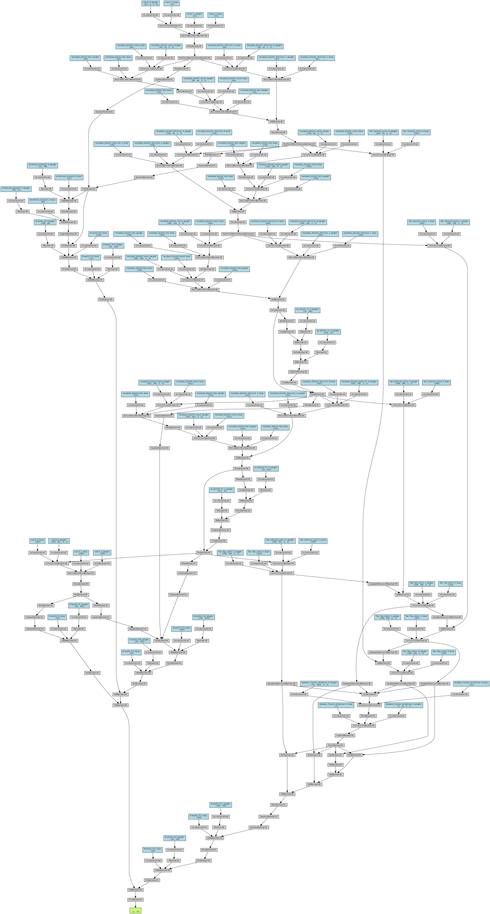

# FusionNet: A Dynamic Feature Fusion Neural Network

**Status**: 🚧 Draft - Work in Progress 🚧

## Overview

**FusionNet** is a novel neural network architecture designed to combine multiple feature representations dynamically and hierarchically. It leverages techniques from residual networks, self-attention mechanisms, feature pyramid networks (FPN), and dynamic feature fusion to enhance the model's ability to capture both low-level and high-level features from input data. This architecture is tailored for image classification tasks and has been initially tested on the CIFAR-10 dataset.

FusionNet is still a work in progress, and this repository is intended to document its development, provide insights into its design, and encourage contributions and discussions on further improvements.

## Key Features

- **Hierarchical Feature Extraction**: 
  - FusionNet employs residual blocks to extract features at multiple levels of abstraction. These blocks enable the network to learn complex patterns while preserving information from earlier layers.

- **Self-Attention Mechanisms**: 
  - Integrated self-attention blocks after key residual layers help the network focus on important features, potentially improving performance on tasks with varying contextual dependencies.

- **Feature Pyramid Network (FPN)**: 
  - The FPN module allows FusionNet to aggregate and fuse features across different scales, improving the model's ability to detect objects of varying sizes and contexts.

- **Dynamic Feature Fusion**: 
  - FusionNet uses a dynamic feature fusion mechanism to combine the outputs from different branches of the network. This approach enhances the model's ability to weigh the importance of different feature representations adaptively.

- **Multi-Branch Architecture**: 
  - FusionNet consists of multiple branches, each focusing on different levels of features (low-level, high-level, etc.). The final output is a weighted combination of these branches, enabling a more robust decision-making process.

## Potential Advantages

- **Improved Generalization**: 
  - By leveraging multiple feature levels and attention mechanisms, FusionNet has the potential to generalize better across diverse datasets and tasks.

- **Enhanced Feature Representation**: 
  - The combination of FPN and dynamic feature fusion allows FusionNet to create richer feature representations, which could be beneficial in complex image classification tasks.

- **Flexibility and Adaptability**: 
  - FusionNet's architecture is designed to be flexible, with multiple branches and fusion techniques that can be adjusted or extended based on the specific requirements of different tasks.

## Current Status

FusionNet is a work in progress. While initial results on CIFAR-10 are promising, further testing and optimization are needed to fully realize its potential. Future work will involve:

- Experimenting with different datasets and tasks to validate the architecture's effectiveness.
- Tuning hyperparameters and architectural components for better performance.
- And more... :-)

## Limitations & Future Work
- Hyperparameter Sensitivity: The current architecture has several hyperparameters (e.g., branch weights) that may require fine-tuning for optimal performance on different datasets.
- Computation Overhead: The dynamic fusion and multi-branch structure can lead to higher computational costs, which might be a limitation for deployment on resource-constrained devices.
- Ongoing Development: FusionNet is under active development. Future versions may include improvements to the dynamic fusion strategy, additional self-attention mechanisms, and optimizations for faster training and inference.

## Contributing
I welcome contributions to FusionNet! If you have ideas for improvements or find any issues, feel free to open a pull request or an issue on the GitHub repository.

## Acknowledgements
This project was inspired by recent advances in deep learning, including residual networks, feature pyramid networks,attention mechanisms and others.

## Architecture
At this state the model has 9,063,096 parameters. \
